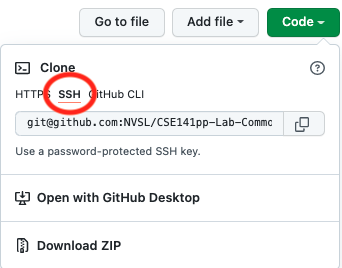
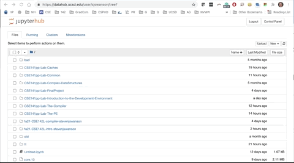

# Introduction to the Development Environment


This lab is in a Jupyter notebook (`Lab.ipynb`).  To run it'll you'll need to 

1.  Get access to Docker (either through campus or on your own machine)
2.  Check out the lab.

This document describe how to do those two things.  Then, you'll be able to
open the Jupyter notebook and proceed with lab itself.

**NOTE:** There is a pre-lab reading quiz due on Wednesday.  For this lab, I've
provided a [pdf of the lab](./Lab.pdf) (I know it appears very long, but it's
not really that much text) so you can read it without actually connecting to
datahub.  You can take the quiz at https://www.gradescope.com/courses/316365.

# Software You Will Need

**Note** Safari and Internet Explorer are not currently supported.  This will
probably be fixed by the next lab, but for this lab you should use Chrome
(first choice, most tested) or Firefox.  Edge Seems to be ok.


All your work for the class will be done in a docker container, and most of it
will be done in a Jupyter Notebook inside that docker container.

Docker containers are self-contained Linux-based workspaces.  Using docker
ensures that your code runs in a consistent environment for you and the
autograder/course staff.

Jupyter Notebook is an interactive computing enviroment for gathering and
displaying data (among other things).

The content for each lab will be distributed via github classroom.

So, to do the course, you need:

1. You'll need to log into datahub.ucsd.edu to run a jupyter notebook. 
2. Tha lab from github classroom.  Find the link on the course home page: https://github.com/CSE141pp/Home/.

## Connecting to UCSD Datahub

The first step is to visit

https://datahub.ucsd.edu/ 


One of two things will happen:

1. You'll find yourself at a nice home page and you can click the big golden "Log In" button. 

2. If you've used the system before/recently it might drop you directly into a jupyter notebook file browser.

If you it's #2, you will need to click "Control Panel" (upper right) and then
click the big red "Stop My Server" button, if it's there.  If it's not, that's
fine.  Then click "Logout" (upper right) to get back to the homepage and the
big golden button.

Now, click the big golden button and login with your `@ucsd.edu` email address.
You'll be presented with a list of Course Environments to choose from.  Select
the one for `CSE 142L [FA21]`.

After a progress bar, you'll end up at the Jupyter Notebook file browser.
Looking at an empty directory (unless you've used the Datahub before, in which
case your old files will be there).  In any case, you don't have a lab to do
yet.

You can now proceed with the instructions below for cloning the lab repo.  Once
you complete them, you can return to the Jupyter Notebook file browser and open
your lab notebook.

### Important Note

Datahub tries to keep your session alive, so if you navigate away and then come
back later, your notebook will still be there and it will initially seem to be
working, but then commands in the notebook will start failing and complaining
about "stale file handles". If this happens, you need to go to "control panel"
and stop your server and then restart it.

## Cloning the Lab Repo

First, accept the assignement on Github Classroom.  It's available via the 142L
[home page](https://github.com/CSE141pp/Home/).

This will set you up with a copy of the starter repository.

**Note**: Be sure to use the **`ssh`** method to checkout your repo rather than `http`.  Authentication over ssh is much simpler and it's what our tools assume.  If you try to use HTTP, you'll get something like:

```
sjswanson@dsmlp-jupyter-sjswanson:~/tt$ git clone http://github.com/NVSL/CSE141pp-Lab-Common.git
Cloning into 'CSE141pp-Lab-Common'...
Username for 'https://github.com': stevenjswanson
Password for 'https://stevenjswanson@github.com':
remote: Support for password authentication was removed on August 13, 2021. Please use a personal access token instead.
remote: Please see https://github.blog/2020-12-15-token-authentication-requirements-for-git-operations/ for more information.
fatal: Authentication failed for 'https://github.com/NVSL/CSE141pp-Lab-Common.git/'
```



You'll need to open a terminal from data hub.  From the file browser, lect "new->terminal" from the menu in the upper right.
At the resulting Linux prompt, you can `git clone` the repo locally.




You may need to create an ssh key and add it to your github account.  You can create the key with (in your datahub terminal):

```
ssh-keygen
```

and accept the defaults.  I recommend no password, so you don't have to type it all the time.

Then view your new public key:

```
cat ~/.ssh/id_rsa.pub
```

Then follow these instructions:

https://docs.github.com/en/github/authenticating-to-github/connecting-to-github-with-ssh/adding-a-new-ssh-key-to-your-github-account


## Open the Notebook

Switch to the tab with file browser and navigate to the directory you just cloned.   Click on `Lab.ipynb` to open the lab and get to work!

**Note:** You'll need to trust the notebook when Jupyter asks.
